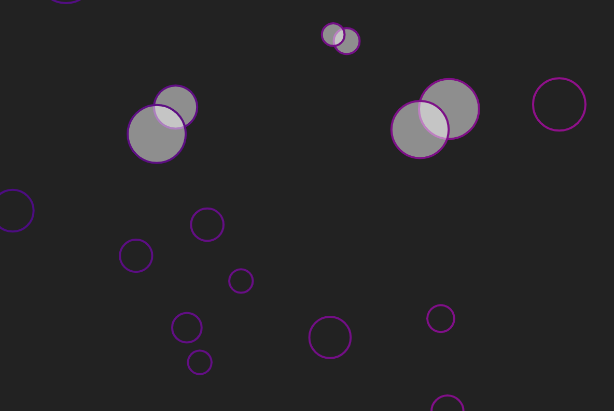

# Bubbles (p5.js)
> This is a simple app showing bubbles on canvas. Written in JavaScript library p5.js. 

## General info
The goal of this project is to show that I am familiar with the use of the basics of the p5.js library and with the interaction with objects.

## Technologies
- HTML
- JavaScript
- p5.js

## Screenshots

## Usage
Download all files or clone repository to your local machine and open `index.html` 

## Inspirations
This project was inspired by [videos on YouTube](https://www.youtube.com/c/TheCodingTrain) by Daniel Schiffman from The Coding Train.